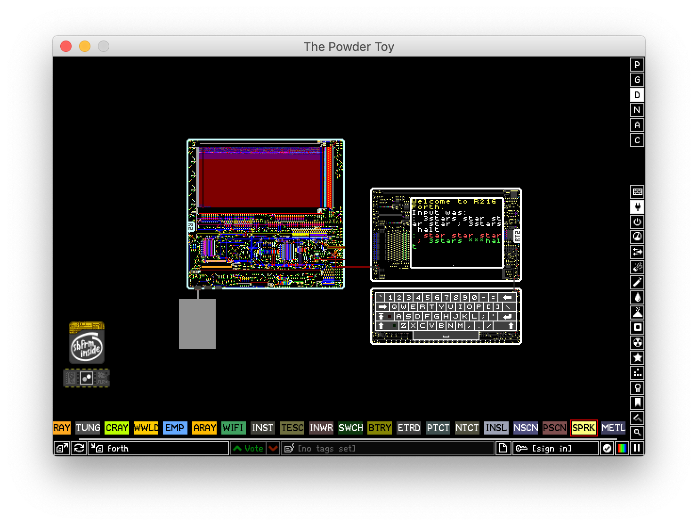

# A Forth for the R216K8B computer



## What?
This project aims to implement the Forth programming language on the
[R216 computer by LBPHacker](https://lbphacker.pw/powdertoy/R216/manual.md).  The
computer is implemented completely in the video game [Powder
Toy](https://powdertoy.co.uk/), so this Forth will be one of the few
systems out there that target a fictional computer.  Since Forth is
extremely easy to port, it only takes a couple of primitive routines
to get started writing the whole thing again.

The default program `forth.asm` reads up to 50 characters of input,
then runs it while printing out colored words to show how that word
was treated (green for interpreted, red for compiled, yellow for
interpreted due to the word being flagged as immediate).  This was
very helpful for debugging words like `:` and `;` that mess around
with the interpreter's state.

Here's an example Forth program.
```forth
: stars zero do star loop ; ten stars halt
\ => **********
```

## Why?
Fictional computers are great.  One can learn a lot from both
implementing and playing around with them.  But when was the last time
you saw a Forth REPL in fictional computer?  What about a Forth REPL
in a fictional computer implemented in a powder simulation game?
Well, now you have!  From the relative success of my [previous
project](https://github.com/siraben/zkeme80), a Forth-based operating
system for TI-84+ calculators, I thought it would be fun to write
another one.  From initially knowing nothing about the architecture,
Within two days I got a REPL working with compile/interpret states,
and now it's just a matter of porting all the other Forth words we
know and love.

## Building and running R216 Forth
Ensure you have a recent version of Powder Toy (this was tested on
version 94.1).

Clone [the assembler](https://github.com/LBPHacker/R216) and this
repository using Git.  Open the file `blank.cps` in Powder Toy, you'll
see a computer, screen and keyboard.  Open the Lua console by pressing
~ and type the following:

```lua
r2asm = loadfile("<path to repo>/r2asm.lua")
```

Where `<path to assembler repo>` is the absolute path to the cloned assembler.
Then, type in

```lua
a = "<path to this repo>/forth.asm"
```

To define a variable `a` to shorten lines (Powder Toy truncates long
commands).  Finally, you can assemble `forth.asm` by running:

```lua
r2asm(a, 0xDEAD, "<path to logfile>")
```

Where `<path to logfile>` is the path to a log file which you can open
to see if the assembling worked.  Close the console by pressing ~, and
SPRK on the giant block of TTAN to begin using R216 Forth!

## Future plans
- [ ] Add ability to read numbers
  - [ ] Relies on multiplication routine
- [ ] An assembler for the R216 written in Scheme
  - [ ] Allows for creation of advanced macros, easy porting of
        parts of [a similar existing implementation](https://github.com/siraben/zkeme80/blob/master/src/forth.scm)
